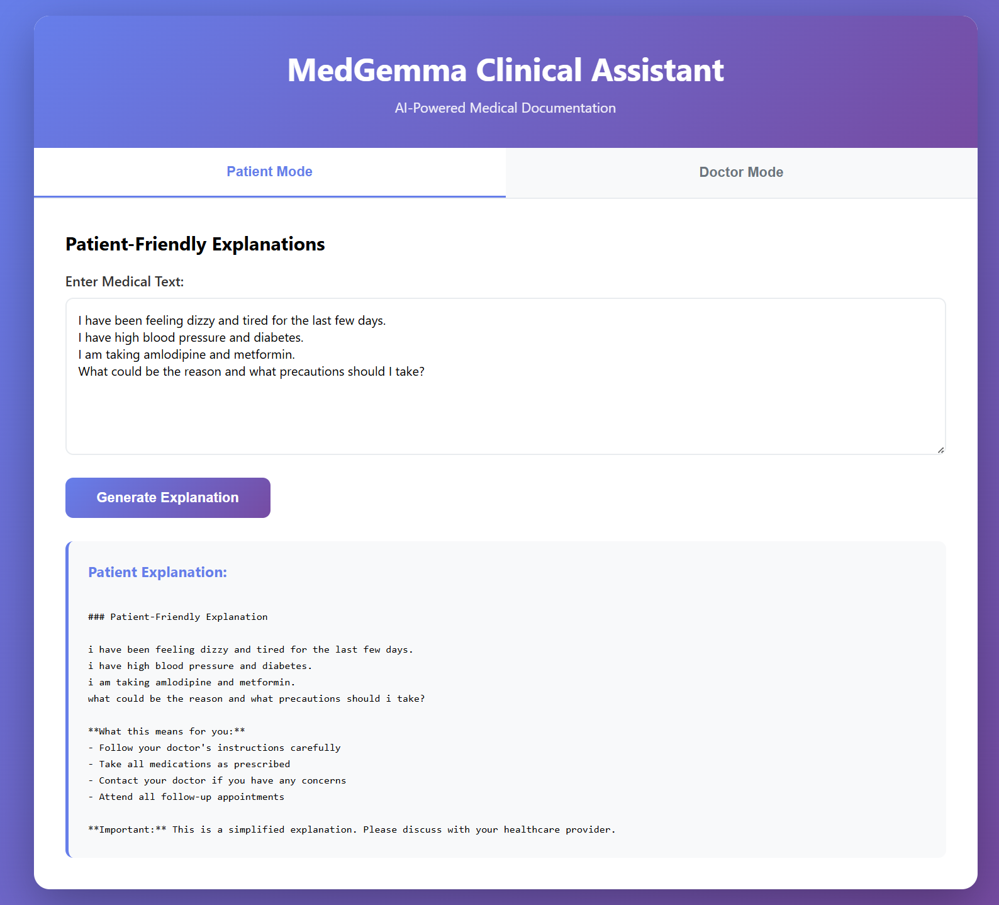
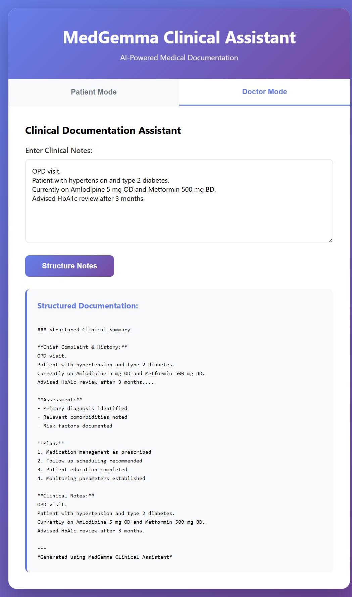

# MedGemma Clinical Assistant🩺

## Overview
An AI-powered web application that helps convert raw medical text into: 
- **Patient-friendly explanations** (Patient Mode)
- **Structured clinical documentation** (Doctor Mode)

Built using *Flask + HTML/CSS + JavaScript**, this tool improves clarity, communication, and documentation efficiency in healthcare workflows.

## 🚀Features

### 🙍Patient Mode: Simplifies medical jargon
- Converts complex medical terminology into simple, understandable language
- Highlights important conditions and medications
- Helps patient better understand their diagnosis and treatment

### 🧑‍⚕️Doctor Mode: Structures clinical notes
- Structures unorganized clinical notes into a professional medical summary
- Automatically generates:
  - Chief Complaint & History 
  - Assessment
  - Plan
- Useful for OPD notes, discharge summaries, and documentation

## 🖥️Technology Stack
- **Backend**: Flask
- **Frontend**: HTML/CSS/JavaScript
- **Model Logic**: Simulated MedGemma clinical assistant
- **Deployment**: Localhost / Cloud-ready


## 📸Application Screenshots

### Patient Mode (Input + Output)


### Doctor Mode (Input + Structured Output)


Screenshots show both input and generated output together for better clarity.


## How to run Locally
```bash 
git clone https://github.com/alok844937-design/medgemma-clinical-assistant.git
cd medgemma-clinical-assistant
pip install flask 
pip install -r requirements.txt
python app.py
```
Open browser and go to:
http://127.0.0.1:5000

### Docker Deployment
```bash
docker build -t medgemma-assistant .
docker run -p 5000:5000 medgemma-assistant
```

## Project Structure
```
medgemma_clinical_assistant/
├── app.py
├── requirements.txt
├── Dockerfile
├── README.md
├── prompts/
├── demo_data/
|-- demo/
|-- screenshots/
├── evaluation/
└── tests/
```
## 💡Use Cases
. Medical OPD documentation
. Patient education & counselling 
. Clinical note structuring 
. Hackathons & healthcare demos

## AI Model Note 
This project currently uses a simulated MedGemma-style response pipeline to demonstarte offline clinical assistance workflows.

## Planned Upgrade 
- Replace rule-based processing with MedGemma/LLM inference
- Support offline quantized medical models
- Add clinical safety guardrails & citations

## Architecture 
User Input <br>
⬇️<br>
Mode Selection (Patient / Doctor)<br>
⬇️<br>
AI Processing Layer<br>
⬇️<br>
Formatted Output

## Why MedGemma Clinical Assistant?
- Doctors spend 30-40% time on documentation
- Patients struggle to understand medical jargon
- This tool brings both with AI-assisted clarity

## ⚠️Disclaimer
This application is for educational and demonstration purposes only. 
It does not replace professional medical advice.

## 🎥Demo Video
A 90-second walkthrough demonstrating:
- Offline execution 
- Passing automated tests 
- Patient and doctor workflows 

Demo script available in `demo/VIDEO_SCRIPT.md`.

## 📜License
MIT License

## 👨‍💻Author
Alok<br>
Computer Science & Data Analytics<br>
IIT Patna<br>
